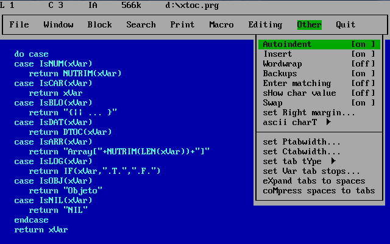

# QEdit

## Version 01: Enter text into a List of strings

This first version must allow the user to enter text and store it in a 
List of strings. The user will be allowed to type text and to press 
Enter to start a new line. You must use Console.ReadKey instead of 
Console.ReadLine, so in this version yo do not need to take care of the 
cursor keys nor Backspace (yet). Also, you must not allow lines longer 
than 80 characters (yet). The keys pressed when at column 80 will be 
ignored, except Enter.

When the user presses F10, the program will quit and save the changes 
to a file whose name will be asked to the user. As an alternative, the 
file name will be read from command line upon start, if the user has 
specified it.

This was the look of the original QEdit. Yours will not have dropdown 
menus (yet) but must show a first line with black text and grey 
background (showing the current line, current column and file name) and 
the text with in light blue colour with dark blue background:

Your main class must be named QEdit, and the data must be stored in a 
class name ListOfStrings, which will have a method "Get(n)", which will 
return the string that is in a certain position, a property "Amount" to 
return the number of existing lines and a method "Add(s)" to add a 
string to the end of the existing data structure.

The interface can be in Spanish or English, but the source (names of variables, 
comments, etc) must be in English.

---

## Entrega 01: Guardar texto en una lista de cadenas

Esta primera versión debe permitir al usuario introducir texto y 
almacenarlo en una lista de cadenas. Se podrá escribir texto y pulsar 
Enter para comenzar una nueva línea. Debes emplear Console.ReadKey en 
lugar de Console.ReadLine, pero esta versión no tiene que tener en 
cuenta las teclas del cursor ni Retroceso (todavía). Además, no debe 
permitir líneas de más de 80 caracteres (aún). Las teclas que se pulsen 
cuando el cursor esté en la columna 80 se ignorarán, excepto Enter.

Cuando se pulse F10, el programa saldrá y guardará los cambios en un 
archivo cuyo nombre se le preguntará al usuario. Como alternativa, el 
nombre del archivo se leerá desde la línea de comando al inicio, si el 
usuario lo ha especificado.

Este era el aspecto del QEdit original. El tuyo no tendrá menús 
desplegables (aún) pero debe mostrar una primera línea con texto negro 
y fondo gris (que muestra la línea actual, columna actual y nombre de 
archivo) y el texto debe tener color azul claro con fondo azul oscuro:

La clase principal debe llamarse QEdit, y los datos deben en una clase 
llamada ListOfStrings, que tendrá un método "Get (n)", que devolverá la 
cadena que está en una posición determinada, una propiedad "Amount" a 
devuelva el número de líneas existentes y un método "Agregar (s)" para 
agregar una cadena al final de la estructura de datos existente.

El interfaz puede estar en castellano o en inglés, pero el fuente (nombres
de variables, comentarios, etc) debe estar en inglés.

